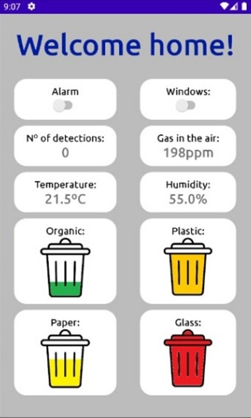

# Android App

## How to import the app into my PC?

**Note: You have to change the IP address in the source code twice for the IP of your Raspberry Pi or where you have installed the WebSocket server and the MQTT broker**

First unzip the file with the [app](./myIoTApp2.zip). Then start Android Studio and click on "Open an existing Android Studio project". Finally, navigate to the root directory of the project and click OK.

## How does the app look

