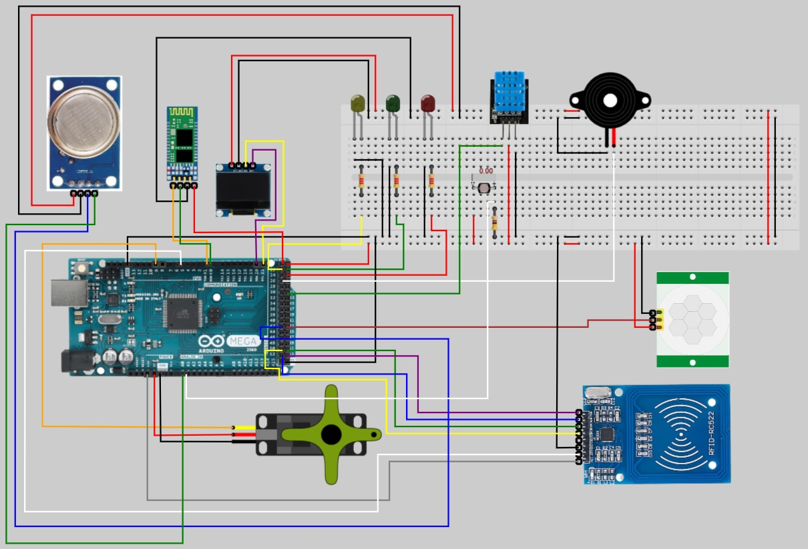

# Arduino Code

## This how the sensors are currently connected to the Arduino

## Installing

**Note: In order to load succesfully the source code to the Arduino, the pin coming from the TX pin at the Bluetooth module HC-06 MUST be disconnected from the pin RX at the Arduino board to prevent a collision in the serial port**

Load the [source code](/Arduino/TESTv4%20-%20Final/TESTv4%20-%20Final.ino) into the board, after installing the Arduino IDE, following the steps explained in this [post](https://support.arduino.cc/hc/en-us/articles/4733418441116-Upload-a-sketch-in-Arduino-IDE)