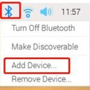
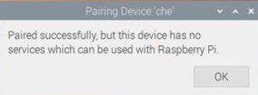
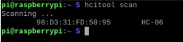
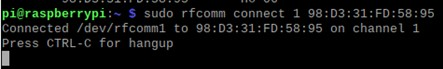
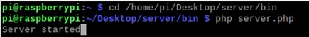
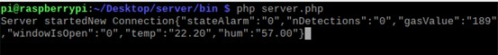
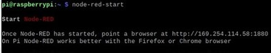

# Smart Home Prototype

This is a Smart Home Prototype developed during my Master's Thesis of the MSc of Internet of Things. In order to read more about this project, check the [Documentation](Docs/).

  
 

## Getting Started

This repository stores the source files of every component of this prototype, but before running it, take a look at the prerequisites to check if you are ready for the deployment.

### Prerequisites

Requirements for the hardware, software and other tools to build, test and push.

#### Hardware

- [Arduino Mega 2560 Rev3](https://store.arduino.cc/products/arduino-mega-2560-rev3) (Or similar board).
- [Raspberry Pi 4 Model B 8GB](https://www.kubii.es/raspberry-pi-3-2-b/2955-raspberry-pi-4-modelo-b-8gb-3272496309050.html?src=raspberrypi) (Or similar board, doesn't need to be 8GB).
- For the rest of the hardware components (sensors, LEDs, wires, etc) check the chapter number 5 (**Bugdet**) in the [Documentation](Docs/) where all the links of the materials used are.

#### Software
- [Arduino IDE](https://docs.arduino.cc/software/ide-v2) (1.0 or 2.0).
- [Android Studio Arctic Fox | 2020.3.1 Patch 2 September 1, 2021](https://developer.android.com/studio/archive) (Or similar IDE).

## Installing

A more detailed README will be inside each different folder in order to explain the installation of the different tools in each platform.

## Setting up the system

Now that we have everyting installed in every platform. Lets run the whole system:

1. Turn On the Arduino.

2. Open the VNC desktop of the Raspberry Pi, click on the Bluetooth icon in the top right corner, and select Add Device.  
 

    Then, go to the Bluetooth search interface, wait for a moment, you can find the corresponding HC-06 module, click on Pair to pair. Follow the instructions and enter the Bluetooth pairing password (in the case of the HC-06 is 1234). If there is an error as shown in the following figure, you can simply ignore it.  
     

    Open the Raspberry Pi command line and enter `hcitool scan`. It scans for available Bluetooth devices (with MAC address). After some time, it will output the devices found like it is displayed:  
     

    Then enter the command `sudo rfcomm connect 1 98:D3:31:7D:58:95`. If the connection is successful, the communication between both devices is ready to go.  
     

3. Now, it is time to start the server. In order to do that, lets change the directory where the server is located, in my case: `/home/pi/Desktop/server/bin`. Once in the correct folder, launch the command `php server.php`. Now, the Web service is running.  
 

    The next step is connecting the Android app to the server. This is the easiest step because the only thing which is needed to do is *launching the app* due to the fact that the app is connected to the server via WebSocket on the start-up of the app. If the app is connected successfully a message displaying `New Connection` message is going to appear in the console as well as the current data from the Arduino.  
     

4. Last but not least, in order to have component in the system up and running, launch the app Node-RED which will start the mosquito service that will start the MQTT broker and the MQTT publisher simulating the sensors of the trash cans.  
 

    Of course, check in the Node-RED app if the MQTT nodes are connected to the broker succesfully

5. At this point, the prototype is ready, once we have launched successfully all the components.

## Authors

  - **Joserra13**

  [![LinkedIn][linkedin-shield]][linkedin-url]

## License

This project is licensed under the [CC0 1.0 Universal](LICENSE.md)
Creative Commons License - see the [LICENSE.md](LICENSE.md) file for
details.

[linkedin-shield]: https://img.shields.io/badge/-LinkedIn-black.svg?style=for-the-badge&logo=linkedin&colorB=555
[linkedin-url]: https://www.linkedin.com/in/jos%C3%A9-ram%C3%B3n-h-572a86234/
