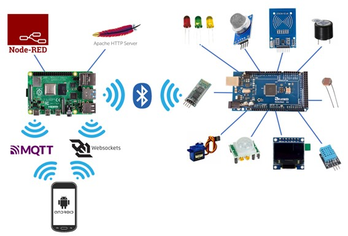

# Smart Home Prototype

This is a Smart Home Prototype developed during my Master's Thesis of the MSc of Internet of Things. In order to read more about this project, check the [Documentation](Docs/)

## Getting Started

This repository stores the source files of every component of this prototype, but before running it, take a look at the prerequisites to check if you are ready for the deployment.

### Prerequisites

Requirements for the hardware, software and other tools to build, test and push 

#### Hardware

- [Arduino Mega 2560 Rev3](https://store.arduino.cc/products/arduino-mega-2560-rev3) (Or similar board)
- [Raspberry Pi 4 Model B 8GB](https://www.kubii.es/raspberry-pi-3-2-b/2955-raspberry-pi-4-modelo-b-8gb-3272496309050.html?src=raspberrypi) (Or similar board, doesn't need to be 8GB)
- For the rest of the hardware components (sensors, LEDs, wires, etc) check the chapter number 5 (**Bugdet**) in the [Documentation](Docs/) where all the links of the materials used are.

#### Software
- [Arduino IDE](https://docs.arduino.cc/software/ide-v2) (1.0 or 2.0)
- [Android Studio Arctic Fox | 2020.3.1 Patch 2 September 1, 2021](https://developer.android.com/studio/archive) (Or similar IDE)

### Installing

#### Arduino 

Load the [source code](/Arduino/TESTv4%20-%20Final/TESTv4%20-%20Final.ino) into the board, after installing the Arduino IDE, following the steps explained in this [post](https://support.arduino.cc/hc/en-us/articles/4733418441116-Upload-a-sketch-in-Arduino-IDE)

#### Raspberry Pi

The Raspberry needs to have several aditional tools which are going to be installed by the command line.

- Update the system

      sudo apt-get update

      sudo apt-get upgrade

- Install Python

      sudo apt-get install python3.6

- Install Apache

      sudo apt install apache2
    
    Check it is working

      sudo systemctl status apache2

- Install PHP

      sudo apt install php libapache2-mod-php php-mysql

    Restart apache

      sudo systemctl restart apache2

    Check it is working by opening this file

      sudo nano /var/www/html/info.php

    Write this text

      <?php phpinfo(); ?>

    Save and open this URL in the browser

      http://localhost/info.php

    If everything went fine, you should be able to see the info of the PHP version installed.

#### Android App

## Running the tests

Explain how to run the automated tests for this system

### Sample Tests

Explain what these tests test and why

    Give an example

### Style test

Checks if the best practices and the right coding style has been used.

    Give an example

## Deployment

Add additional notes to deploy this on a live system

## Built With

  - [Contributor Covenant](https://www.contributor-covenant.org/) - Used
    for the Code of Conduct
  - [Creative Commons](https://creativecommons.org/) - Used to choose
    the license

## Contributing

Please read [CONTRIBUTING.md](CONTRIBUTING.md) for details on our code
of conduct, and the process for submitting pull requests to us.

## Versioning

We use [Semantic Versioning](http://semver.org/) for versioning. For the versions
available, see the [tags on this
repository](https://github.com/PurpleBooth/a-good-readme-template/tags).

## Authors

  - **Billie Thompson** - *Provided README Template* -
    [PurpleBooth](https://github.com/PurpleBooth)

    [![LinkedIn][linkedin-shield]][linkedin-url]

See also the list of
[contributors](https://github.com/PurpleBooth/a-good-readme-template/contributors)
who participated in this project.

## License

This project is licensed under the [CC0 1.0 Universal](LICENSE.md)
Creative Commons License - see the [LICENSE.md](LICENSE.md) file for
details

## Acknowledgments

  - Hat tip to anyone whose code is used
  - Inspiration
  - etc

[linkedin-shield]: https://img.shields.io/badge/-LinkedIn-black.svg?style=for-the-badge&logo=linkedin&colorB=555
[linkedin-url]: https://www.linkedin.com/in/jos%C3%A9-ram%C3%B3n-h-572a86234/
